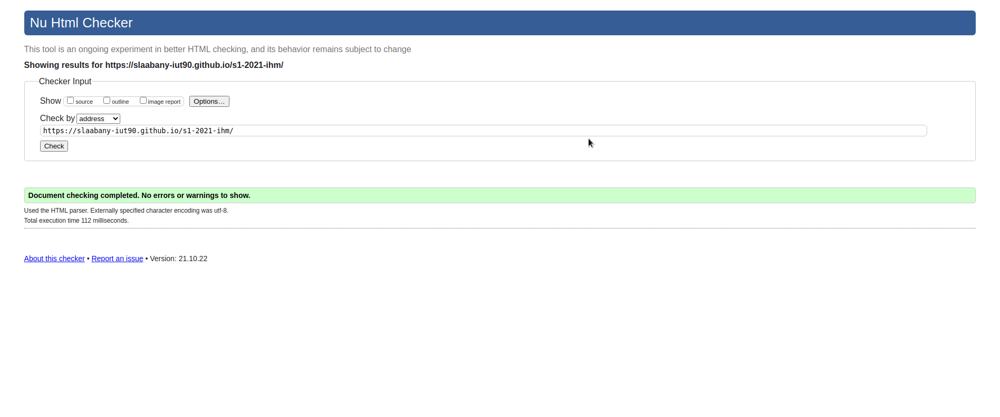

**Voici notre groupe:**

[LAABANY Shakir](mailto:shakir.laabany@edu.univ-fcomte.fr?subject=SAE_1_06)

Bilel BOUHEDDA

Zinedine OUDINI

Emmanuel DESGRONTE

S1C1

**Voici l'écran de zoning:**

Pour l'écran de zoning nous nous sommes réunis afin de trouver la meilleur composition possible. Nous voulions avoir assez d'illustration et de texte pour pouvoir donner le plus d'information possible tout en gardant assez d'espace libre afin que la page d'accueil ne soit pas chargée.

**Voici l'écran prototype:**

Afin de produire l'écran prototype, nous nous sommes inspirée de certains sites moderne et épurée. Nous trouvons que l'image qui disparaît petit à petit lorsqu'on descend dans la page ammène un coté moderne et un aspect plus attrayant.

# Livrable parties Économie et Documents numérique
[Livrable économie](doc/LAABANY_OUDINI_BOUHEDDA_DESGRONTE.pdf)

**Informations sur le site**

Notre site web comporte 5 pages et présente l'entreprise Webedia. Le menu de la page d'accueil ramène aux résumés de chaques page. Pour acceder à ces pages, il suffit de cliquer sur le bouton **En savoir plus**. Le rapport est disponible en téléchargement à la fin de la page d'accueil. Nous avons choisis ces couleurs pourle site car nous trouvions qu'elles apportaient un aspect épuré.

**Attestation validation W3C

